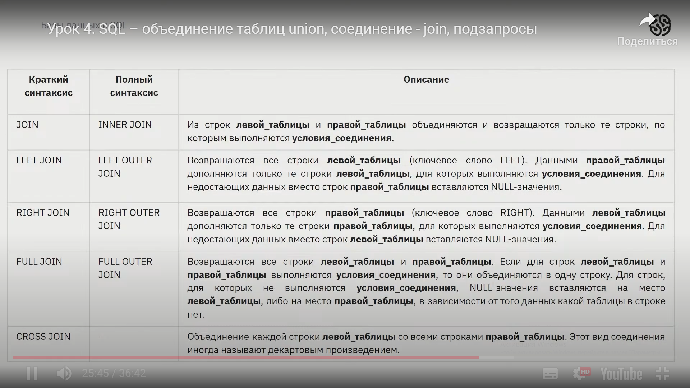

## Запрос выборки данных с простыми условиями
SELECT [Название_полей], [], [] FROM имя_таблицы
WHERE [название_полей = данные];

# Базы данных
## Создание
CREATE DATABASE [имя];

## Показать все базы данных
SHOW DATABASES;

## Использование
USE [имя_базы_данных];

# Таблички
## Создание
CREATE TABLE [имя_таблички]
(
    [имя_колонки] [тип_данных_колонки],
    [имя_колонки] [тип_данных_колонки],
    [имя_колонки] [тип_данных_колонки],
    [имя_колонки] [тип_данных_колонки]
)

# Типы данных
* INT - целочисленый 32
* DECIMAL - числа с заданной точностью
* BOOL - 0 или 1
* VARCHAR([чило_символов]) - строка символов
* TEXT - множество строк
* DATE - только дата (гггг:мм:дд)
* TIME - только время (чч:мм:сс)
* DATETIME - дата и время с 1000 года
* TIMESTAMP - дата и время с 1970 года
* BLOB - 65 КБ бинарных данных
* LARGEBLOB - 4 ГБ бинарных данных

# Комментарии

/*

Многострочные

*/

\# Однострочный

-- Однострочный

# Логические операторы

* выражение1 AND выражение2 (true если true оба выражения)
* выражение1 OR выражение2 (true если одно из выражений true)
* NOT выражение1 (true если выражение равно false)

# Условия

* CASE

CASE

* IF

IF([Условие],[Правда],[Лож])

# DDL

Data Definition Language - это группа команд, которые используются для создания и изменения структуры объектов базы данных: таблиц, представлений, схем и индексов.

* CREATE - создать
* ALTER - изменить
* DROP - удалить

# DML

Data Manipulation Language — это группа операторов, которые позволяют получать и изменять записи, присутствующие в таблице. Разберем отдельные DML-команды.

* INSERT - заполнить(вставка данных)
* SELECT - выделить(извлечение данных)
* UPDATE - изменить (обновить данные)
* DELETE - удалить

# Фильтрация данных

* ORDER BY - сортировка

SELECT [поля_выборки]
FROM [имя_таблицы]
ORDER BY [по_какому_столбцу_сортировать];

* LIMIT(MySQL), TOP(SQL Server) - сортировка по номеру

SELECT [поля_выборки]
FROM [имя_таблицы]
LIMIT [колличество_пропущеных_записей] [сколько_строчек_вывести];

SELECT TOP[колличество_пропущеных_записей] [сколько_строчек_вывести] [поля_выборки]
FROM [имя_таблицы];

* DISTINCT - вывод уникальных значений

SELECT DISTINCT [поле_для_нахождения_уникальных_значений], [поле_для_нахождения_уникальных_значений] FROM [имя_таблицы];

* WHERE

SELECT [поля_выборки]
FROM [имя_таблицы]
WHERE [условия_фильтрации_строк];

* GROUP BY

SELECT [поля_выборки]
FROM [имя_таблицы]
GROUP BY [столбцы_для_групировки];

* HAVING

SELECT [поля_выборки]
FROM [имя_таблицы]
HAVING [условие_фильтрации_групп];

# Агрегатные функции

* AVG - вычисляет среднее значение

SELECT AVG([имя_поля]) FROM [имя_таблицы];

SELECT AVG([имя_поля]) FROM [имя_таблицы]
WHERE [другое_поле] = [какоето_значение]; - (средняя стоимость Aplee)

* SUM - вычисляет сумму значений

* MIN - вычисляет наименьшее значение

SELECT MIN([поле_выборки]) FROM [имя_таблицы];

* MAX - вычисляет максимальное значение

SELECT MAX([поле_выборки]) FROM [имя_таблицы];

* COUNT - колличество строк в вашем запросе

SELECT COUNT([поля_выборки]) FROM [имя_таблицы]; - колличество строк

SELECT COUNT(*) FROM product; - колличество строк в таблице продукт

# Операторы обьединения

* Union - приращивает снизу к табличке 1, табличку 2 колличество полей у обоих таблиц должны совпадать(выдаёт только уникальные значения)

SELECT firstname, lastname
FROM users
UNION ALL SELECT firstname, lastname 
FROM other_users;

SELECT 'Не Люблю', 'Цифру 5', phone
FROM users
WHERE phone 
LIKE '%5%'
UNION SELECT firstname, lastname, phone 
FROM users;

* Union ALL - приращивает снизу к табличке 1, табличку 2 колличество полей у обоих таблиц должны совпадать

SELECT firstname, lastname
FROM users
UNION SELECT firstname, lastname 
FROM other_users
UNION ALL SELECT firstname, lastname 
FROM other_users;(Прирастить две одинаковые таблички 2 снизу)

* Join

# Подзапросы

* IN - ПРоверяет на присутсвие

SELECT * 
FROM [таблица_1]
WHERE [поле_таблицы_1]
IN (SELECT [поле_таблицы_2]
    FROM [таблица_2])

Пример

SELECT *
FROM users
WHERE firstname IN (SELECT first_name FROM other_users);

(Проверяем есть ли имена из таблички 2, в  табличке 1)

SELECT *
FROM users
WHERE firstname NOT IN (SELECT first_name FROM other_users);\

(Выводит имена которых небыло)

* EXISTS

SELECT *
FROM users
WHERE EXISTS (SELECT * 
			  FROM other_users 
              WHERE users.firstname = other_users.first_name);

(Проверяем есть ли имена из таблички 2, в  табличке 1)

* Копирование таблиц

CREATE TABLE [имя_новой_таблицы] 
SELECT *
FROM [старая_табличка];

# Ранжирующие функции

* PARTITION BY

SELECT OVER(PARTITION BY [поле1] ORDER BY [поле2]) - группирует по полю1 и сортирует по полю2

